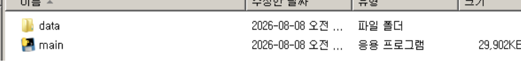
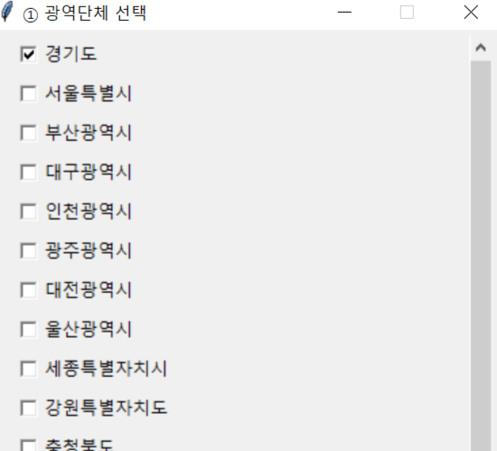
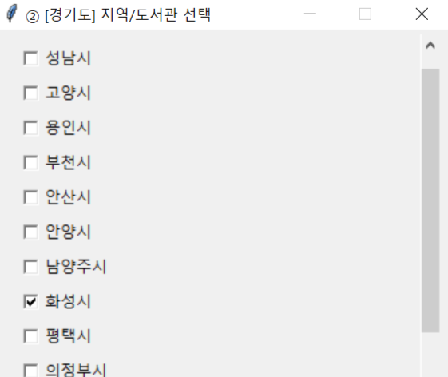
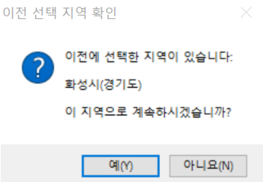
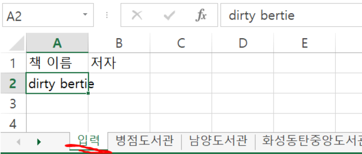
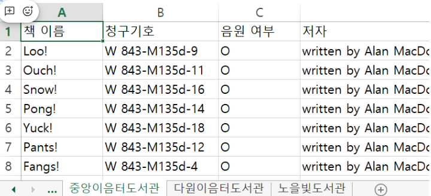

## 1. 최신 버전 다운로드
[📥 최신 버전 다운로드 (release.zip)](https://github.com/Kennnnnnnnnnnnnnnnnnnnnnnnnnnnnn/scrape-kor-libs/releases/latest/download/release.zip)

## 2. 압축 해제 및 main.exe 실행

## 3. 광역 단체 선택

## 4. 지역 선택

## 3-A. 이전 선택 불러오기
- 한번이라도 실행한 이력이 있는 경우 아래 팝업이 나타남
- '예'를 누르면 3, 4번 단계 넘어감

## 5. 책 정보 입력
- 입력 시트에 입력
- 저자는 필수 아님

(엑셀 화면이 다시 나올 때까지 대기..)

## 6. 책 정보 확인
- 도서관 별로 출력 시트 생성

